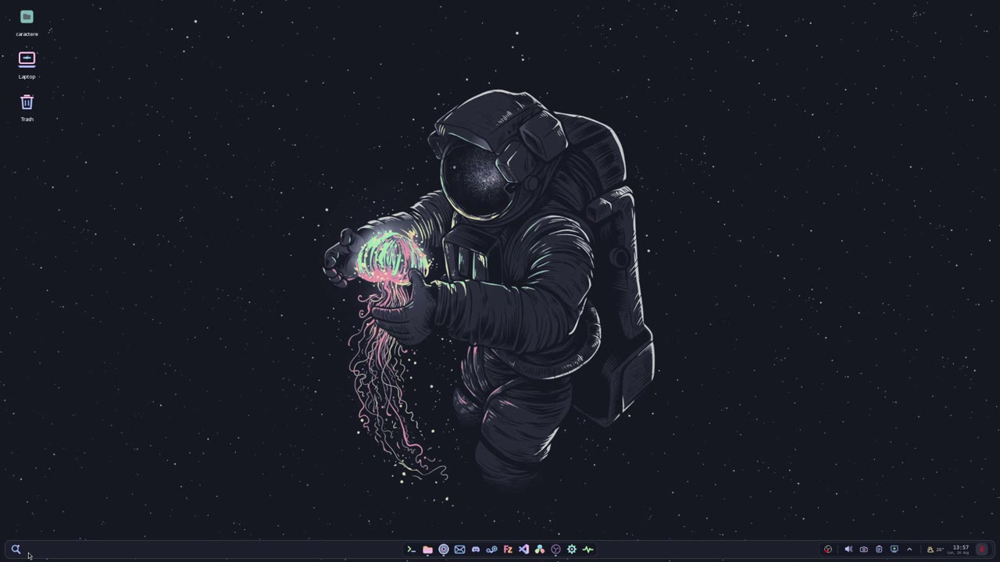

# Catppuccin Quickshell for XFCE/X11

A lightweight Catppuccin Mocha taskbar for XFCE on X11, built with
[Quickshell](https://quickshell.outfoxxed.me/). It can run next to the standard
XFCE panel while you test it, and can later replace that panel without
uninstalling any XFCE packages.

> This project currently targets **XFCE on X11**. It is not a Wayland panel.

## Demo

[](https://github.com/MixGitstore/xfce-catppuccin-quickshell/blob/main/assets/demo.mp4)

▶ **[Watch the full 78-second demo](https://github.com/MixGitstore/xfce-catppuccin-quickshell/blob/main/assets/demo.mp4)**

The video demonstrates the bar, launcher, file search, running applications,
window controls, audio devices, calendar, notifications, and system resources.

## Features

- Catppuccin Mocha styling with matching bundled SVG icons.
- Smooth bottom-edge autohide with a short reveal delay.
- The bar stays pinned on the desktop and with restored windows.
- Automatic autohide for maximized and snapped/tiled windows.
- Complete lockout over true fullscreen windows, so games and fullscreen video
  do not reveal the bar or leave a visible activation line.
- Application launcher with animated expansion and keyboard navigation.
- Search across installed applications, files, and folders.
- Fast bounded file search through the existing `plocate` database instead of
  recursively scanning the home directory.
- Pinned applications plus automatically detected running applications.
- Active/running indicators, click-to-focus, and click-again-to-minimize.
- A chooser for multiple windows of the same application, including a close
  button for each individual window.
- Application context menus with window actions, application actions, and
  Pin/Unpin controls.
- StatusNotifier system tray support, including native right-click menus for
  applications such as Steam, Discord, and qBittorrent.
- Region screenshot, in-memory clipboard history, and Show Desktop controls.
- PipeWire output volume, microphone controls, device selection, mute, and
  MPRIS media playback controls.
- NetworkManager popup with active connection information and Wi-Fi support
  when an adapter is present.
- Notification server, popup history, actions, clear controls, and toasts.
- Weather for a configurable location, clock, date, and monthly calendar.
- System popup with CPU, RAM, GPU, storage, Switch User, Restart, and Shut Down.
- Lazy popup creation, event-driven X11 window tracking, and no permanent
  resource polling while the relevant popup is closed.

## Tested environment

- Fedora Linux 44
- XFCE 4.20 on X11
- Quickshell 0.3.1
- PipeWire/WirePlumber
- NetworkManager

Other XFCE/X11 distributions may work, but the package installation commands
and a few XFCE paths can differ.

## Requirements

Install the Fedora dependencies:

```bash
sudo dnf copr enable errornointernet/quickshell
sudo dnf install quickshell wmctrl curl plocate gcc libX11-devel make xprop \
  xfce4-screenshooter pavucontrol papirus-icon-theme xdg-user-dirs
```

The UI is designed for **Maple Mono NF Base Regular**. If that font is not
installed, Qt will use a fallback. Install the font separately or change
`fontFamily` and `monoFamily` in `Theme.qml`.

Optional application buttons in `Apps.js` expect their corresponding programs
to be installed. Missing applications do not prevent the bar from starting.

## Installation

### 1. Clone into the Quickshell configuration directory

```bash
mkdir -p ~/.config/quickshell
git clone https://github.com/MixGitstore/xfce-catppuccin-quickshell.git \
  ~/.config/quickshell/xfce-catppuccin
cd ~/.config/quickshell/xfce-catppuccin
```

The `xfce-catppuccin` directory name matters because the helper scripts and
autostart entry use that Quickshell configuration name.

### 2. Build the small X11 event helper

```bash
./setup.sh
```

The helper reacts to window geometry events. It does not continuously poll the
screen. `setup.sh` only builds and checks the configuration; it does not disable
or remove anything from XFCE.

### 3. Test it alongside XFCE

```bash
qs -c xfce-catppuccin
```

Keep the XFCE panel enabled during this first test. Verify Search, audio,
notifications, the tray, fullscreen behavior, and your application commands.

Stop the test instance with:

```bash
qs kill -c xfce-catppuccin
```

### 4. Enable safe side-by-side autostart

After the manual test succeeds:

```bash
./enable-autostart.sh
```

This starts Quickshell at the next XFCE login and deliberately keeps the XFCE
panel available. Undo it without deleting the configuration:

```bash
./disable-autostart.sh
```

## Configuration

### Change the weather city

Edit `UserConfig.qml`:

```qml
readonly property string weatherCity: "Iași"
readonly property real weatherLatitude: 47.1585
readonly property real weatherLongitude: 27.6014
readonly property string weatherTimezone: "auto"
```

Replace the city name, latitude, and longitude. Coordinates can be copied from
[OpenStreetMap](https://www.openstreetmap.org/) or another trusted mapping
service. Keep `weatherTimezone` set to `"auto"` unless you need to force a
specific IANA timezone such as `"Europe/Bucharest"`.

Save the file while Quickshell is running; the configuration should reload
automatically. Weather is fetched from Open-Meteo at startup, when the calendar
opens, and then at most once every 15 minutes.

### Change pinned applications

Edit the `pinned` array in `Apps.js`, or use Pin/Unpin from an application's
right-click menu. Each manual entry can contain:

- `name`: label displayed by the bar.
- `pinKey`: desktop entry ID, normally ending in `.desktop`.
- `wmClasses`: values used to match existing X11 windows.
- `command`: executable and arguments used to launch the application.
- `iconSource`: bundled or custom SVG path.
- `contextActions`: optional application-specific menu commands.

To discover a window class, run `xprop WM_CLASS`, then click the application
window. If Zen Browser or Zed uses a different executable on your machine,
change its `command` entries in `Apps.js`.

Runtime Pin/Unpin order is stored in `pinned-apps.json`.

### Change fonts, dimensions, or colors

Edit `Theme.qml`. It contains the font families, bar height, button and icon
sizes, spacing, corner radii, and Catppuccin colors.

### Profile image and username

The menu reads the current account name from `$USER` and loads the standard
`~/.face` image. The image is optional.

### File search

File and folder results require an up-to-date `plocate` database. On Fedora:

```bash
sudo updatedb
```

Search starts after two typed characters and returns a bounded result set.

## Optional XFCE integration

Test every Quickshell feature first. These steps **disable startup entries or
replace shortcuts only**; they do not uninstall packages or erase the original
XFCE panel configuration.

### Replace the XFCE panel after testing

```bash
./replace-xfce-panel.sh
```

This assigns Quickshell to the XFCE session slot normally used by
`xfce4-panel`, stops the current panel, and avoids a duplicate Quickshell
autostart entry. The XFCE panel package and its configuration remain installed.

Rollback:

```bash
./restore-xfce-panel.sh
```

### Replace App Finder shortcuts

```bash
./use-quickshell-search.sh
```

This maps `Super+R`, `Alt+F2`, `Alt+F3`, and left `Ctrl+Shift` to Quickshell
Search. App Finder is not uninstalled and is not a permanent background process.

Rollback:

```bash
./restore-xfce-appfinder.sh
```

### Disable duplicate network and notification tray services

After confirming both Quickshell popups work:

```bash
./use-quickshell-services.sh
```

This disables the XDG autostart entries for `nm-applet` and
`xfce4-notifyd`. NetworkManager itself stays enabled and Quickshell talks to it
directly.

Rollback:

```bash
./restore-xfce-services.sh
```

### Disable Clipman autostart

The built-in clipboard keeps the last 10 text entries in memory for the current
session. It does not persist history and does not replace all advanced Clipman
features. If this is sufficient:

```bash
./disable-clipman-autostart.sh
```

Rollback:

```bash
./restore-clipman-autostart.sh
```

### Disable the GeoClue demo agent

The weather widget uses fixed coordinates and does not need location discovery:

```bash
./disable-geoclue-agent.sh
```

Rollback:

```bash
./restore-geoclue-agent.sh
```

### Advanced: disable automatic GVFS network discovery

This is an independent memory optimization, not a feature replaced by
Quickshell. Do not use it if you rely on the file manager's automatic Network,
WSDD, DNS-SD, or Windows/Samba share discovery.

```bash
./disable-gvfs-network.sh
```

Rollback:

```bash
./restore-gvfs-network.sh
```

KDE Connect is a separate service and should not be disabled by these steps.

### Components that should remain enabled

Do not disable or remove these services for this configuration:

- `xfdesktop` — desktop, wallpaper, icons, and desktop menu.
- `xfwm4` — X11 window manager.
- `xfsettingsd` — XFCE settings daemon.
- XFCE Power Manager and the authentication/polkit agent.
- NetworkManager.
- PipeWire and WirePlumber.
- KDE Connect, if you use it.

## Resource-conscious design

- No blur, custom shaders, or heavy shadows.
- One clock update per minute.
- Weather refresh limited to once per 15 minutes.
- Audio, calendar, clipboard, system, network, and notification popups are
  created lazily and destroyed after closing.
- System resource sampling runs every two seconds only while its popup is open.
- X11 window and snap state are event-driven instead of continuously polled.
- File search uses the indexed `plocate` database and returns at most 12 files.
- Clipboard history remains in memory and is never written to disk.

Actual RAM use depends on the Qt version, graphics driver, icon theme, active
tray applications, and the services enabled in the XFCE session.

## Troubleshooting

Show the current log:

```bash
qs log -c xfce-catppuccin --no-color
```

Rebuild the X11 helper:

```bash
make clean && make
```

If applications appear but do not launch, update their commands and window
classes in `Apps.js`. If file results are missing, run `sudo updatedb`. If the
audio popup is empty, confirm PipeWire and WirePlumber are active.

A portal warning about an application ID can be harmless when the configuration
otherwise reports `Configuration Loaded`; inspect the remaining log for QML or
service errors.

## Project layout

- `shell.qml` — root configuration and per-screen bar instances.
- `UserConfig.qml` — weather and profile settings intended for users.
- `Bar.qml` — bar behavior, launcher, popups, and controls.
- `Apps.js` — default pinned applications and their actions.
- `Theme.qml` — Catppuccin palette, fonts, and dimensions.
- `assets/icons/` — bundled SVG icons.
- `X11FullscreenTracker.qml` and `watch-x11-geometry.c` — event-driven X11
  window state tracking.
- `*.sh` — focused integration, search, action, and rollback helpers.

## License

The project is released under the [MIT License](LICENSE). See [NOTICE.md](NOTICE.md)
for Catppuccin inspiration and third-party trademark information.
